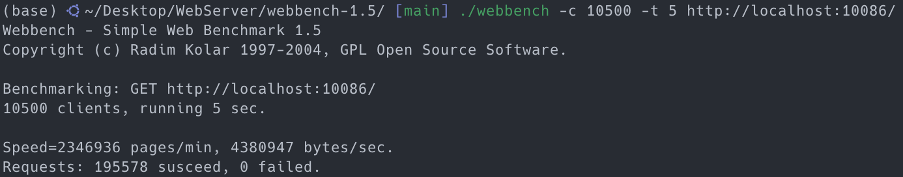

# C++轻量级多线程Web服务器

## 1. 项目说明

+ 项目简介：Linux环境下使用I/O多路复用技术实现的Reactor高并发服务器，主要分为以下五个模块：
    + 利用RAII机制设计数据库连接池，减少数据库连接建立与关闭的开销；
    + 采取半同步/半反应堆的并发编程模式作为线程池的实现方案；
    + 利用单例模式与阻塞队列实现了异步日志系统，记录服务器的运行状态；
    + 基于时间堆实现定时器，关闭超时的非活动连接以降低处理器消耗；
    + 基于主从状态机解析HTTP请求报文，同时支持GET和POST请求。

+ 项目参考：本项目主要参考了[TinyWebServer](https://github.com/qinguoyi/TinyWebServer/tree/raw_version)项目和[《Linux高性能服务器编程》](https://dark-wind.github.io/books/Linux%E9%AB%98%E6%80%A7%E8%83%BD%E6%9C%8D%E5%8A%A1%E5%99%A8%E7%BC%96%E7%A8%8B.pdf)的设计思想，并在具体实现方面做出了许多改进：
    + 在数据库连接池和日志系统设计方面，针对于```init()```函数，使用原子变量保障线程安全，并禁止多次调用```init()```。
    + 在线程池的实现中，将回调函数（而非原项目中的```http_conn```类）作为模板类型，以提高线程池的复用性。
    + 在日志系统方面，使用可变参模板和包扩展的方式，可将任意类型的数据组合并格式化为一条日志消息。
    + 在定时器的实现中，使用时间堆来替代原项目中的链表结构，从而提高定时器的处理效率。
    + 更多的修改不在此一一列出，可以前往博客[C++轻量级多线程Web服务器（上篇）](https://lijiang99.github.io/2023/07/27/Project/WebServer1/)、[C++轻量级多线程Web服务器（下篇）](https://lijiang99.github.io/2023/08/01/Project/WebServer2/)查看项目详解。

## 2. 项目运行
+ 测试环境
    + Ubuntu 22.04.3 LTS
    + MySQL 8.0.34
    + Chrome、Firefox浏览器
    
+ 建立数据库
    
```sql
-- -----------------------------------------------------
-- 创建新的数据库和数据表
-- -----------------------------------------------------
create database web_server;
USE tiny_web_server;
CREATE TABLE user(
    username char(50) NULL,
    passwd char(50) NULL
)ENGINE=InnoDB;
-- -----------------------------------------------------
-- 向数据表中添加数据
-- -----------------------------------------------------
INSERT INTO user(username, passwd) VALUES('lijiang99', '123456');
```
    
+ 编译构建
    
```cpp
// 修改main.cpp中的数据库登录密码password
connPool->init("localhost", "root", 3306, "password", "web_server", 8);
```
    
```shell
# port需指定为具体的端口号
make server && ./server port
# 在浏览器中输入localhost:port即可
```
    
+ 压力测试
    
```shell
cd webbench-1.5
./webbench -c 10500 -t 5 http://localhost:port
```
    

